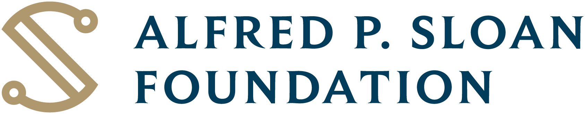
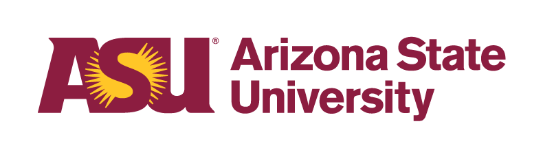

### SciCodes 2025 Collaboration Workshop 
#### Dates and location
#### April 10-11, 2025 &#9830; [Arizona State University Barrett &amp; O'Connor Washington Center](https://washingtondc.asu.edu/barrett-and-oconnor-center)
#### [1800 I Street, NW, Washington DC 20006](https://maps.app.goo.gl/Ef8YeuvQESn8fhqA6)
#### BlueSky: [SciCodes](https://bsky.app/profile/scicodes.bsky.social) #scicodes

### Purpose

The [Consortium of Scientific Software Registries and Repositories (SciCodes)](https://scicodes.net) 2025 Collaboration Workshop, scheduled for **April 10-11, 2025 in Washington, DC**, will bring together editors and maintainers of diverse scientific software registries and repositories alongside open research software advocates and practitioners. This will be a small event with 20 invited participants due to the workshop’s needs and goals, venue capacity, and available funding. The workshop's goals are to: (1) improve adoption of and revisit our published [best practices for research software registries and repositories](https://doi.org/10.7717/peerj-cs.1023), (2) enable software search and discovery over multiple member resources through [interoperable metadata](https://codemeta.github.io), and (3) advance published research software quality through supporting cyberinfrastructure that help communities adopt FAIR and frictionless software engineering practices.

The Alfred P. Sloan Foundation has provided funding for the workshop and symposium, and Arizona State University is providing access to its event facilities within the [Barrett &amp; O'Connor Washington Center](https://washingtondc.asu.edu/barrett-and-oconnor-center).

The workshop will also be preceded by a half-day pre-workshop symposium on April 9, 2025, with up to 50 participants to reflect on the current state and future trajectories of the research software ecosystem. 

### Symposium

SciCodes is holding a half-day symposium on April 9, 2025 to invite the research software engineering (RSEng), funder, and science communities to reflect and focus on a long term visions and aspirations for research software and computational science.

This symposium will provide concrete guidance on development priorities for science gateways and research software registries and repositories; it will also help guide the work that SciCodes participants do in a follow-up workshop.

The symposium will be a hybrid event held in Washington DC (limit of 50 in-person attendees) with remote participation via Zoom and include a keynote address by [Katherine Skinner](https://investinopen.org/about/team/katherine/) from [Invest in Open Infrastructure](https://investinopen.org/about/), a panel discussion with [Daniel S. Katz](https://danielskatz.org/) ([NCSA, U. Illinois Urbana-Champaign](https://www.ncsa.illinois.edu/)) and [Hervé Ménager](https://research.pasteur.fr/fr/member/herve-menager/) ([Institut Pasteur](https://www.pasteur.fr/)), and a facilitated open discussion with all attendees, both in-person and remote.

To participate in this symposium and lend your voice to improving the research software ecosystem, [please register here](https://docs.google.com/forms/d/e/1FAIpQLSfTxuCJjmlAyc0S6odgVQdleYrwR1j_geE20HbVGJw5MXnOYA/viewform)! And please share with any others who may be interested.

### Organizers

- [Allen Lee, Arizona State University](https://orcid.org/0000-0002-6523-6079)
- [Alice Allen, ASCL/UMD](https://orcid.org/0000-0003-3477-2845)
- [Daniel Garijo, Universidad Politécnica de Madrid](https://orcid.org/0000-0003-0454-7145)
- [Lorraine Hwang, University of California Davis](https://orcid.org/0000-0002-1021-3101)
- [Tom Morrell, Caltech](https://orcid.org/0000-0001-9266-5146)

<!--
### [Agenda](Agenda.md)

### [Remote access](RemoteAccess.md)

### [Logistics](Logistics.md)  

### [Participants](Participants.md)

### [Links for workshop activities](ActivitiesLinks.md)

### [Workshop and presentation slides](https://github.com/ASCLnet/SWRegistryWorkshop/tree/master/presentations)  

### [Workshop evaluation](https://forms.gle/ksjx6o6pNkbS8gsSA)  

### [Workshop products and results](Products/Products.md)

### [Photo album](https://mikehucka.smugmug.com/Work/Software-meetings/SSRCW-2019/)  
-->

### Funding

This workshop is made possible by the generous financial support of the [Alfred P. Sloan Foundation](https://sloan.org/) as well as logistical support from [Arizona State University](https://www.asu.edu).

