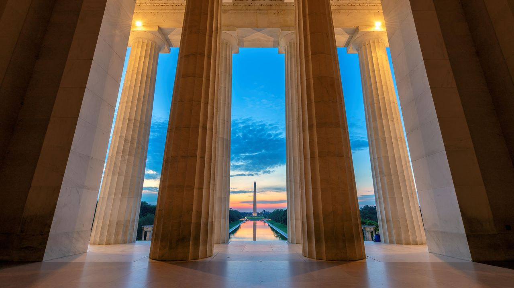

# 2nd SciCodes Collaboration Workshop
## Dates and Location

April 10-11, 2025 &#9830; [Arizona State University Barrett &amp; O'Connor Washington Center](https://washingtondc.asu.edu/barrett-and-oconnor-center)

The [Consortium of Scientific Software Registries and Repositories (SciCodes)](https://scicodes.net) 2nd Collaboration Workshop, scheduled for **April 10-11, 2025 in Washington, DC**, will bring together editors and maintainers from a wide range of scientific software registries and repositories as well as open research software advocates and expert practitioners.

The workshop's primary goals include: 

1. *improve* adoption of and revisit [best practices for research software registries and repositories](https://doi.org/10.7717/peerj-cs.1023)
2. *enable* federated software search and discovery over multiple member resources by exposing [curated, interoperable metadata](https://codemeta.github.io)
3. *advance* published research software quality through cyberinfrastructure that helps research communities adopt FAIR and frictionless software engineering practices

## Agenda (all times in EST)

### Workshop Day 0 - Wednesday April 9, 2025 (1215 - 1630)
#### Location: 8th Floor Event Pavilion, ASU Barrett & O'Connor Center

1330 	Symposium recap with workshop attendees: refine workshop priorities and breakout group work streams

1630 	Close / cleanup

1730    Dinner on your own or optional group dinner at [Western Market](https://www.westernmarketdc.com/) / [Taberna del Alabardero](https://alabardero.com/)

### Workshop Day 1 - Thursday April 10, 2025

0800 	Arrival + Breakfast

0900 	Introduction / Welcome

0915 	Breakout Groups: software metadata interoperability, software tools to improve research software, revisiting best practices, FAIR metadata assessments, CodeMeta Working Group over Zoom

1030 	Coffee/Tea Break

1045 	Temperature check

1100 	Breakout Groups

1200  	Reconvene / Share-out

1215 	Lunch

1315 	Full group discussion / continue breakout groups

1430 	Break (coffee / tea / snacks)

1445 	Continue working groups

1645 	Reconvene, recap

1700    Close

1800  	Group Dinner at [CIRCA](https://www.circabistros.com/location/foggy-bottom/)

### Workshop Day 2 - Friday April 11, 2025
#### Location: 8th Floor Event Pavilion, ASU Barrett & O'Connor Center

0800 	Arrival + Breakfast

0900 	Intro and continue breakout group work: software metadata interoperability, software tools to improve research software, revisiting best practices, FAIR metadata assessments

1030 	Coffee/Tea Break

1045    Breakout Groups

1145  	Reconvene / share out / establish prioritized roadmaps for future work for each breakout group

1200 	Lunch

1300 	Full group discussion, establish final priorities and work streams for SciCodes members

1430 	Coffee/Tea Break

1445 	Wrap up, establish final priorities and work streams for SciCodes members

1600    Close, safe travels all!

&copy; lucky-photographer/Alamy
